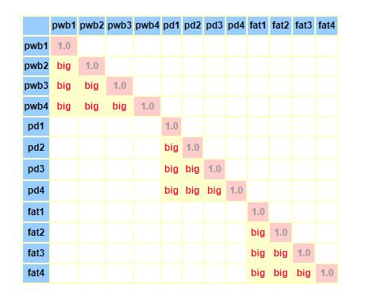
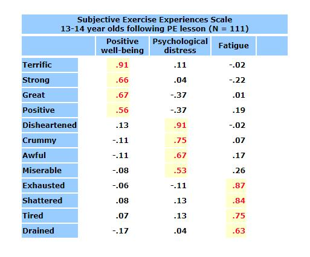

> Accurate reckoning: The entrance into the knowledge of all existing things and all obscure secrets.                                                           Ahmes, ancient Egyptian scribe, 1680-1620 BC.

如果这个科学公理是科学过程的中心，那么测量也是一个核心的科学活动。 无论是测量原子的直径，两颗星之间的距离，运动员的有氧运动能力，还是某人的锻炼动机，科学家都参与了测量业务。  至少从实证主义的角度来说，测量是理解的基础，如果测量要引导我们理解，就必须精确地进行。

再回想一下上一堂课。 我们讨论的另一件事是理论发展和测试是如何科学的。 我们看了克林格（Kerlinger）（1986）对一个理论的定义：

> A theory is a set of interrelated constructs (concepts), definitions, and propositions that present a systematic view of phenomena by specifying relations among variables, with the purpose of explaining and predicting the phenomena.

注意**variables**这个词。 显然，变量是不一样的。 如果他们是不同的，他们必须在一些地方或者一些指标上有所不同。 所以如果我们对这些变化或者不同感兴趣，我们必须测量它。 但是如果我们的措施各不相同，会发生什么？ 假设我想测量两个固定点之间的距离，但是我的尺子是弹性的。 根据我施加多少力，距离看起来会有所不同，但实际上它保持不变。因此，我们的测量措施必须是一致的。

让我们来看另一个测量场景，这对我们体育和锻炼科学家来说更有意义。 假设我想测量某人是多么的胖。 最常用的肥胖指标之一是体重指数（BMI），即体重与身高的比值。 它是用一个人的体重除以他们身高的平方来计算的。 BMI因其计算简单快捷而被广泛使用，并且与身体脂肪高度相关。 短而胖的人比身材瘦高的人有更高的BMI。 但是那些脂肪少但肌肉丰富的健美运动员呢？ 尽管瘦弱，他们的BMI也会很高。 所以BMI不一定是一个精确的体脂指标。

这些例子说明了测量中的两个关键问题。我们的措施必须既一致又准确，或者更实际一致，尽可能准确。在技术术语中，这些问题被称为测量的可靠性和有效性。在这里，我们将更详细地探讨这些问题。首先，我们需要考虑各种不同类型的测量。

## 测量的级别  **Levels of measurement**

测量是给对象添加数字的过程。 有很多不同类型的对象可以被测量，并且不同类型的对象可以以不同的级别或数量相互关联。 例如，假设我给每个班级的学生一个号码，以1到100来表示他们。假设我也把我在学期末考试中的学生排名从1改为100.例如，数字10在这两种情况下意味着完全不同的东西。 在第一种情况下，数字10只是识别学生，而在第二种情况下，数字10表示学生在考试中胜过90名同学。 这说明了测量水平或尺度的含义。 基本上有四个级别的测量，从最基本的到最精细的：名义(**nominal**)，序数(**ordinal**)，区间(**interval**)和比率(**ratio**)。

名义标度(**Nominal Scales**)只是简单的使用数字来标记对象。上面通过给学生分配数字来识别学生的例子说明了这种测量。另一个例子是在性别上分配不同的数字，如1 =男性，2 =女性，或在实验中给治疗和对照组标记数字。我们应用名义变量通常被称为分类变量，因为这些数字表示对象的不同类别。对于名义标度来说，重要的一点是分配的数字的相对值本身没有意义，它们并不涉及数量：对女性给予2并不意味着它们比被分配1的男性好，聪明，快速或任何其他。事实上，名义标度根本就不是真正的数值，因为它们不是沿着连续的方向来衡量项目的。他们只是标签。

在序数标度(**Ordinal Scales**)中，分配数字是为了表示对象沿着某个属性呈连续的排序。因此，序数值是真实的尺度。排名从1到100的学生的考试成绩就是一个序数的例子。在这里，不同的数字确实显示了被测量的对象的名次：排名第10当然比20更高。然而，注意到，与名义标度一样，20并不意味着两倍于10。比如，第10名学生在考试中取得了70分的成绩，而第20名学生取得了65分的成绩。此外，有序标度也没有给出任何关于量表点之间相对差异的信息：第10和第20之间的差异不同于20和30之间的差异。如果第10名学生得分为70，第20名得分为65，那么这并不意味着第30名学生必须获得60分。

区间标度(**Interval Scales**)为我们提供了关于标度点之间差异的真实信息。它们的值不仅是连续的，而且间隔的单位差是不变的。摄氏温标就是一个例子。温度计中的汞以相等的间隔升高，因此10摄氏度与20摄氏度之间的差值与20摄氏度与30摄氏度之间的差值相同。然而，间隔标尺中的零点是任意的，并不意味着没有数值。例如零摄氏度并不意味着没有热量，而是简单地任意设定在水的冰点。因此，我们不能把间隔分数表示为一个比例：80摄氏度不是40摄氏度的两倍。这可能有点难以理解，那么考虑下面的例子。假设学生A在生理学考试中正确回答60个选择题，而学生B正确回答30个，而学生C正确回答没有答案。虽然我们可以说学生A的正确回答是B的两倍，但是我们不能说学生A比生理学B更多地了解生理学。我们也不能说学生C对生理学一无所知。

比例标度(**Ratio Scales**)代表了最精细的测量水平。 用这样的尺度，单位之间的差异不仅是恒定的，而且零点可以有意义地确定。 温度的开氏温标就是一个例子。 零度K意味着没有分子的运动，因此没有热量。 更显而易见的例子是长度和重量。 零厘米的长度意味着没有长度！

### 离散变量与连续变量  **Discrete versus continuous variables**

另一个区分测量的度量区别在离散变量和连续变量之间。离散变量只能取整数（实际上，这不是严格正确，但通常是这样，并且将作为一个工作定义）。诸如班级学生人数等变量是离散的。例如，你不能在一个班上有42.75名学生。连续变量是可以在给定范围内取任何值，变量是连续的。例如身高，体重，最大摄氧量等都是连续变量。

## 可靠性 **Reliability**

如上所述，可靠性与一致性有关：测量仪器是否始终如一地给我们提供相同的结果？这里的仪器不一定是指某种机械或电子测量设备。仪器在这个意义上是指任何用来衡量物体某些性质的东西。因此，例如，设计用于衡量焦虑，态度，动机或性格等事物的问卷也是测量工具，在这种情况下，它们被设计用来衡量心理属性，也是仪器。在行为观察研究中，甚至可以把人们称为工具。例如，两个人可能会观看一场足球比赛来记录不公平的做法，犯规次数等。我们希望他们的录音能保持一致（与裁判不同）！顺便说一下，我们通常所说的问卷调查问卷根本不是问卷调查问卷，因为他们通常不提问题。相反，要求个人说明他们在多大程度上同意或不同意一套声明。正确描述这种的词是**inventories**，但“问卷”这个词的使用非常广泛，我们将在这里坚持下去。许多类型的仪器也经常被称为测试，但这并不一定意味着考试意义上的测试。最后，我们经常使用“尺度”这个术语。所有这些单词基本上是可以互换的。

## 经典测试理论  **Classical test theory**

有许多可靠性理论，但最有影响力的是经典测试理论，最早由斯皮尔曼于1904年提出。根据这个理论，从一个仪器得到的分数由两个部分组成，即真实分数和误差分量。这个理论可以简单地表示为：
$$
O = T + e
$$
也就是说，观察得分（O）等于真实得分（T）加上一些误差（e）。观察得分是我们从我们的测量仪器获得的。真实得分是被测量的实际得分。可以认为，如果我们的仪器是完美的，就可以得到分数。问题是没有仪器是完美的，这是引入误差的地方。

这是一个简单的例子。假设您想要使用标记为1毫米间隔的标尺来测量纸上的线的长度。想象一下，将自己的头部直接放在纸张的正上方，俯视线条的末端和标尺上的对应点。根据你的眼睛与尺子和线条的关系，你会高估或低估线条的长度。稍向右边，你低估；稍微向左边，你高估。你不可能把你的眼睛真正地垂直于线的末端。即使你这样做了，你的读数也要取决于你把标尺放在线的起始位置，以及你的眼睛能够辨别标尺上的精细等级。假设线的末端似乎在140和141毫米之间，你叫140.5还是140.4或者140.6？那么，即使有一个奇迹，你不小心撞到了这条线的真正长度，你会再次在另一个场合碰到吗？不太可能。

现在，假设你对此感到沮丧，你决定发明一种用于纸上测量线的电子眼。经过多年的研究和开发，花费数百万英镑，您最终生产的这种仪器能够测量到百万分之一微米的精度。你现在能得到真实的分数吗？当然不是，因为你的电子眼只能精确到百万分之一微米之内！

## 系统误差和随机误差 **Systematic and random error**

有两种类型的测量误差，系统误差和随机误差。系统误差是永远不会改变的错误。垂钓者以夸大他们捕获的鱼的大小而着称。但是他们可能做得相当一致。如果鱼长20厘米，他们会说是30。如果是30，他们会说是40，例如总是加10厘米。这是系统性的错误。它永远不会改变和偏向真正的分数。另一个例子是总是快10分钟的时钟，或者总是低5mmHg的血压计。如果我们意识到这些系统性错误，通常很容易解决。更重要的是，它们不影响可靠性，因为它们是可靠的错误！但是，它们确实会影响效度，我们稍后会谈到。

随机误差是不可预测的，因此会影响可靠性。幸运的是，这种错误的随机性给了我们一个处理它的方法。如果在某个属性上两次测量一个单独的个体，虽然他们的真实分数根本不变，随机误差就表示两次观察到的分数是不同的。然而，由于错误是随机分布的，如果我们将来自感兴趣的个体属性的分数取平均，误差将相互抵消，给出更接近真实分数的东西。不幸的是，我们通常不能从整个人群中获得分数（所以我们需要采样），所以我们不可能将所有正面和负面的错误相互抵消掉。

> 根据大数据的理论，在大数据时代，我们不需要采样，能够获得全部数据，拿着是不是就意味着随机误差会被完全抵消掉呢？恐怕答案是否定的吧。

所以不管我们多努力，我们都不会完全消除我们测量的误差。那么我们要做的是通过开发更复杂的仪器来最小化误差。与此同时，我们仍然有科学的工作去做，所以我们必须使用我们现有的任何工具。估计这些仪器的可靠程度，然后在我们的论文中报告这一点变得非常重要。幸运的是，我们可以做到这一点。可靠性评估主要有四种类型：重测信度(test-retest)，评判间信度( inter-rater)，内部一致性(internal consistency)和并行形式的可靠性(parallel forms reliability)。由于后者在运动和运动科学研究中很少遇到，所以我们只考虑前三项。这些评估可靠性的方法都是基于相关性分析的。

## 重测信度  **Test-retest reliability**

重测信度涉及测量场合的可靠性或稳定性。只要我们测量的属性不变，仪器应该在不同的场合给我们相同的分数。评估重测信度的最广泛使用的方法是在两个不同的场合将得自一组个体的分数相关联。完美的相关性（r = 1.0）表明该仪器在两个时间内是完全一致的。当然，这是不太可能的。然而，重新测试相关性的适当大小是一个可移动的盛宴。这取决于被测量的财产可能在两次测试之间的时间改变多少。对于一个相当固定的属性（一个不应该改变的属性），例如性格，你会期望在很长一段时间，甚至几年之间有很强的相关性。如果你采取一些运动动机的话，应该在很短的时间内得到很强的相关性，但是在一段很长的时间内相关性就变得较弱，这是因为人们的锻炼原因在这个时间内改变了某些东西。

## 评判间信度 **Inter-rater reliability**

评判间信度 是指评判人在某些指标上的分数达成一致的程度。它通常用于行为观察研究，当两个或两个以上的人评估研究参与者展示的一些行为。例如，你可以进行一项研究，检查不同的教练在某种程度上表现出一定的教练行为，如赞美，纠正反馈，批评等等。为了衡量这些属性，你会得到两个或两个以上的评委，根据预先确定的标准评分教练员的每一个行为，然后对这两个评分进行平均。通常情况下，评委将接受培训，以识别不同的行为，并在“真正的”学习之前在实验工作中练习使用评分系统，以确保评分系统的可靠性。换句话说，你要确保两位评委的一致。法官之间的一致性程度可以通过各种方式进行评估，但常用的方法是计算法官得分之间的相关性。在这样的研究中，至少有90％的相关性通常被认为是必要的，以表明可接受的评价者间信度。

## 内部一致性 **Internal consistency**

第三种类型的可靠性评估涉及仪器不同部分的可靠性。我的意思是说，我们可以用几种不同的方式来衡量一个指标，然后把所得到的衡量结果合并为一个单一的分数。问卷是最明显的例子。通常，调查问卷包括许多旨在衡量指标（例如焦虑，态度，性格等）的项目，然后对这些项目进行加和或平均以产生最后的分数。事实上，拥有多个属性指标的行为提高了衡量标准的可靠性，只要它们都衡量相同的事情。作为一个例子，下面是一系列来自EMI-2 体重管理子尺度的项目：

受试者对这四个项目的分数取平均值，以便为体重管理的原因提供一个总分。显然，对于总体平均得分有意义，受访者必须在每个项目上得到至少大致相同的得分。例如，在一个项目上得分5的人应该在所有其他项目上得分5左右。这种可靠性方面被称为内部一致性(**internal consistency**)或同质性( **homogeneity**)。

评估内部一致性的传统方法是检查分半信度。你可以由一群人完成问卷，然后把一半项目的分数与另一半项目的分数相关联。例如，对于上面的体重管理项目，您可以对每个受访者的前两项得分进行平均，对最后两项进行相同的处理，然后将两组得分关联起来。高度的相关性表明两套项目的一致性。问题在于有很多方法可以分割项目，取决于你如何分割项目，你可能会得到不同的结果，所以这种方法可以隐藏潜在的缺乏可靠性。

评估内部一致性的方法多种多样，但是最广泛使用的是Cronbach's alpha可靠性系数。在数学上它是所有可能的分半可信度的平均值。几乎在所有使用问卷调查的研究中，您都会看到。Cronbach's alpha可以从0到1.0的范围内，并且至少0.70的值通常被认为是可接受的。重要的是要注意，它只告诉我们一致的个人得分。它并没有告诉我们，这些项目是否都在测量同样的东西，正如人们经常描述的那样。这是一个有效性问题，而不是可靠性问题。

## 测量的有效性  **Validity of Measurement**

衡量有效性是指仪器测量它应该测量的东西的程度。例如，假设你想开发一个新的现场测试来评估有氧健身。为了测试是有效的，它将评估有氧健身，而不是其他方面的健身，如力量或无氧动力。同样，一个旨在衡量竞争焦虑的问卷应该衡量竞争焦虑，而不是觉醒或情绪状态。

认识到仪器可靠但无效是最重要的。也就是说，它可以可靠地（一致地）衡量错误的东西。另一方面，根据定义，有效的仪器必须是可靠的。如果它正在测量应该测量的东西，它应该始终给出相同的分数。所以可靠性是有效性的必要条件，但不是充分条件。

区分测量有效性和研究的有效性也很重要。研究的有效性是指研究设计是否足以回答所要解决的问题。显然，为了使研究有效，在其中使用的任何测量结果也必须是有效的。另一方面，采取有效措施并不能使研究有效。我们稍后将在讨论研究的有效性。

衡量有效性评估有许多不同方面，事实上这些都是密切相关的。在这里，我们将重点讨论最常见的方面：内容有效性(**content validity**)，标准效度(**criterion-related validity**)，建构效度(**construct validity**)和因子有效性( **factorial validity**)。

## 内容有效性  **Content validity**

在一些工具类型里，问卷是最明显的，但不是唯一的例子，各个项目的分数被结合起来，为被测量的结构产生总分。 EMI-2的四个重量管理项目就是一个例子。内容效度是关于这组项目是否测试了应该测试的内容或者说所测试的内容是否反映了测试的要求，即测试的代表性和覆盖面的程度。换句话说，仪器的各个部分应该充分利用结构的各个方面。例如，运动行为的社会认知理论的一个重要结构是关于人们对运动的可能结果的看法。这个结构是各种标签的行为信念，结果期望，激励等等，这取决于你所喜欢的理论。无论我们说什么，对这个结构的任何衡量都应该包括对人们可能持有的行为结果的全面认识。这些可能包括健身，健康，社交互动，体重控制等等。

与内容有效性密切相关的另一个术语是表面效度。这只是关心是否来测量它是否应该测量的内容。表面和内容有效性的评估依赖于一个仪器的开发人员，他们对这个被设计用于测量的结构和/或已经建立了感兴趣的领域的以前的研究有透彻的理解。通常情况下，乐器的开发者将向他们所在领域的专家小组提交新乐器，以获得对其乐器内容有效性的独立评估。通常要求专家指出他们认为应该取消哪些项目，因为这些项目不适用，并为进一步的项目提出建议。通常还要求他们对每个项目的适用性进行数字评估;然后可以保留一贯获得高分的项目。

## 标准效度  **Criterion-related validity**

与标准相关的有效性与某个工具的分数与相关标准变量的分数相关的程度有关。评估这种情况的常见情况是新仪器的分数与旧仪器的分数相关度。例如，你可能会开发一种新的竞争焦虑量度，因为你觉得现有的量度不是很有效或可靠。所以你会让运动员在适当的环境中完成这两项措施，然后关联两个工具的得分。这个问题是双重的。首先，相关性需要多大来表示有效性？对此没有简单的答案。这取决于情境，研究人员需要判断一个特定的相关性是否足够大。第二，如果旧仪器不是很有效（即旧仪器不是衡量新仪器的有效措施），而新仪器（工具或者方法）又是为什么要相互关联呢？所以这个方法比较弱，但总比没有好。

一个更强有力的方法是将新工具与某些“黄金标准”标准联系起来。例如，通过呼吸气体分析直接评估的VO2 max被认为是有氧能力的黄金标准量度。但是，测量费用昂贵且耗时。因此，研究人员已经开发了许多更简单的现场测试来评估有氧能力，拉夫伯勒20米逐步穿梭运行是最广泛接受的。通过检查他们的得分与VO2最大分数的相关程度，这种测试已经根据直接VO2最大测试的黄金标准进行了验证。不幸的是，我们通常没有这样的黄金标准措施来验证我们的手段。

有两种与标准相关的有效性。如果两个工具的分数是在同一时间点或大约相同的时间点收集的，则称为并发有效性。如果标准上的分数在某个时间晚于正在验证的测试中的分数被收集，则被称为预测有效性。后者的一个例子是，如果你开发了一个测试，旨在从未来的年龄选择未来的精英运动员。你可以对一些年轻运动员进行测试，然后测量他们在运动（不知何故！）几年后的成功，看看测试是否确实预测了成年后的表现。

## 建构效度 **Construct validity**

如果我用一把尺子来衡量在一张纸上画出的一条线的长度，我就毫不客气地宣布我的措施是有效的（虽然也许不是可靠的，如上所述）。我可以直接观察这条线，我知道那是我的尺子者所测量的。然而，我们常常想要测量的东西不是直接可观的，而是一个假设的构想：我们用来理解发生的理论构造。心理学研究充满了焦虑，动机，自信心等。一些显然可以直接观察到的东西也是事实上的结构。以身体健康为例。健身本身不能直接观察，但是我们可以观察身体功能的各个方面，其或多或少地反映身体的适应性，例如最大摄氧量，静息心率，力量和柔韧性。

结构效度是指仪器准确测量这种结构的程度。结构有效性评估主要有三种类型：收敛和区分效度(convergent and discriminant validity)，已知群体差异(known group differences)和因子有效性(factorial validity)的方法。

### 聚合和区分效度  **Convergent and discriminant validity**

任何变量都可以被认为嵌入在与宇宙中所有其他变量的关系网络中。其中一些关系是正面的，有些会是零，有些则是负面的。这种关系也会有所不同。收敛性和区分性有效性是关于检查这个网络中两个或多个工具之间的关系网络的选定部分，以便找到有效性的证据。收敛效度（如标准相关效度）是关于一个度量与相同或相似事物的其他度量之间的关系。这是关于两个工具的分数如何汇合。区分有效性是指两个或多个工具衡量不同事物的程度。例如，抑郁症的衡量不应该衡量幸福，所以它应该区分这两件事情。

在寻求聚合有效性的证据时，我们寻找一个工具和一个收敛标准之间的高度相关性。在寻求区分有效性的证据时，我们寻找工具与标准之间的低或零相关性。两种工具之间强烈的负相关关系也可以作为聚合效度的证据：这就意味着，虽然一种工具是衡量一种资产的相对存在，但另一种工具是衡量其相对缺失。例如，考虑以下两项：

很显然，这两个项目都在测量类似的东西（信心），但是你会期望某个项目得分较高而另一个项目得分较低，反之亦然。因此他们之间的相关性是负的。

研究人员经常提供证据聚合或标准相关的有效性，但不太经常提出的区分效度的证据。这是不幸的，因为两者都提供了更好的支持工具的有效性。

### 已知群体差异  **Known group differences**

已知的组间差异的方法相当简单，涉及比较从已有研究中已知的组中获得的得分，以及所测量的变量的差异。例如，大量研究表明，女性的体重管理锻炼动机往往比男性更强。因此，在EMI-2的体重管理分量表上，女性的得分显着高于男性。

### 因子有效性 factorial validity

因子效度与测试的内部结构有关。这是最常用来检查问卷的有效性。许多问卷都是多维的，即他们挖掘了被测量财产的许多不同但相关的维度。例如，上面提到的“运动动机调查表-2”包含14个维度，每个维度都有不同的运动动机（体重管理，压力管理，力量和耐力等）。每个维度都有一些项目。另一个我相信你会遇到的例子是竞技运动焦虑量表-2（CSAI-2），它有三个维度：认知焦虑，躯体焦虑和自信。

用于评估因子有效性的统计技术被称为因子分析，这并不奇怪。接下来是对因子分析的一个非常基本的介绍，我试图从概念的角度来展示技术，并避免它的数学（你会很高兴听到）。因子分析是用来确定组成多维仪器的项目如何与被测量的不同维度实际相关的先进和复杂的相关技术（或更确切地说是一组技术）。维度被称为因子或潜在变量，问卷项目被称为显性或观察变量。这些维度被称为潜在维度，因为它们不是直接可见的。正如我们在前一节中讨论的那样，它们是假设的构造。比如说，我们不能直接观察别人的自信心。但是，我们可以观察到的是他们对一系列项目的回应，从中我们可以推断出他们的信心水平。

我们将以主观运动经验量表（SEES）为例来考察因素分析。这是由McAuley和Courneya（1994）设计的一个三因素问卷，用于测量运动诱发的感觉状态，这三个因素是心理健康，心理困扰和疲劳。通常，我们将调查问卷的每个维度称为分量表。 SEES中的每个分量表都有四个项目，要求被调查者以7分制表示他们在这个时间点所经历的感受程度。因子分析并不局限于问卷式数据的分析。例如，一些最早的运动和运动科学研究使用银子分析技术来检查体能的不同维度。

工具的因子结构可用图形表示，用圆圈或椭圆表示因子，用正方形或椭圆表示观察项目，从因子到项目的箭头指示哪些项目属于哪个因子，用曲线双头箭头表示因素之间的相关性。以下是SEES的预期结构：

这是SEES结构的一个模型，表明前四项是为了获得积极的福祉，中间四项是心理困扰和最后四项是疲劳（当然，这三个因子并不在问卷调查本身，他们是混合在一起的）。同样重要的是，图片显示前四项不是为了消除心理困扰或疲劳，而中间四项并不是为了获得积极的幸福感或疲劳，而最后四项并不意味着要挖掘心理健康，或心理困扰。请注意，这是一个聚合和区分有效性的例子：这些项目应该收敛于他们的预期因素，并与其非意图因素区分开来。所以我们用这样一个多维度工具来实现的理想就是它具有所谓的简单因子结构。也就是说，这些项目只是衡量他们应该测量的维度。最后，曲线箭头表示这些因素之间的相关性。尽管在图中没有表示，但在这种情况下，幸福感与痛苦和疲劳呈负相关，而悲伤和疲劳呈正相关。

现在，想象一下，在一场运动结束之后，有一大群人填写了SEES，所以我们从每个项目中获得了他们的分数。 想象一下，我们要将项目上的所有分数相互关联起来。 如果这个工具有一个简单的因子结构，我们希望这些项目与来自同一子量表的其他项目强相关（相关），但是与其他子项目的项目只有弱相关，甚至更好，不相关。 所以相关矩阵应该是这样的：

我们应该有相同的因素之间的相关性较大，但在不同因子之间的项目之间小或理想中的零关联。这是因子分析的基础。但是，用这种技术我们更进一步。因子分析假定相关性采取这种模式的原因是因为这些项目是一个较小的一组潜在变量（在这种情况下是三个）的观察指标。因此，因子分析试图确定这个潜在结构是什么，以及哪些项目与哪些潜在变量有关。如果我们的模型是正确的，那么因子结构应该表明前四项与一个因素（我们称之为心理健康）相关，后四项与第二个因子相关，等等。因子分析为我们提供了一个因子矩阵，它与上面的相关矩阵相似，应该显示项目与其预期因素之间的大关系，与非预期因子之间的关系为弱或零。这里是Markland，Emberton和Tallon（1997）的一些数据的因子矩阵。在这种情况下，SEES是由13-14岁的男孩和女孩完成体育课后的一轮比赛。

这些数字被称为因子载荷(**factor loadings**)，可以像相关系数一样被解释。你可以看到，至少在这个样本中，SEES确实有一个相对简单的因子结构，对于它们的预期因子，项目的中等到强烈的负荷以及对非预期因子的负荷要小得多。因此，在13-14岁的孩子中，修改后的SEES的因子结构似乎相当好。

#### 因子分析的探索性与验证性研究 **Exploratory versus confirmatory factor analysis**

传统的因子分析方法被描述为探索性的。这是因为他们实际上涉及对数据的探索。研究人员，或者说近年来他或她的计算机软件，探索项目之间的相关性以揭示潜在的潜在变量。例如，这项技术最初是为了确定智力因素而设计的。研究人员将有大量的人完成一系列智力测试项目，然后进行探索性因子分析，试图找出智力的基础。通过这种方式，他们发现智力具有不同的组成部分，如口头推理和视觉空间能力。从这些研究人员开始，他们并不知道他们将要找到什么，而潜在变量是在分析完成之后给出的名称，这些分析基于对在其上的物品的解释。

不过，在目前的大多数情况下，无论是基于以前的研究，还是基于理论的SEES，您都已经知道测试的因子结构是什么。近年来，技术已经被开发出来，并正在被越来越广泛地使用，直接测试一个仪器的预测因子结构，看看假设模型与数据的吻合程度如何。这种方法被称为验证性因子分析（CFA），因为它着手确认工具的结构是否与预期一致。运动和运动心理学家已经率先应用这种方法，所以你很可能在你读的研究论文中碰到它。但是，终审法院是复杂的，关于如何最好地应用它，有很多争议，而且经常被滥用。由于这些原因，我会给你一些一般的指导方针，以帮助你评估CFA的研究，如果你遇到他们。如果你觉得这很困难，别担心。这是，但是你完全掌握它并不重要。在这个阶段，你所需要的就是这些原理的一个共同的想法。

关于因子分析，大家有兴趣的可以去[原网址](http://pages.bangor.ac.uk/~pes004/resmeth/measurement.htm)看一下。

