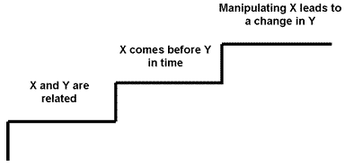
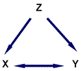
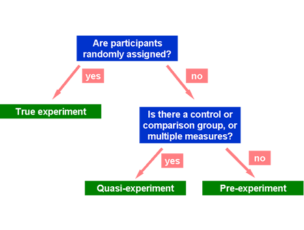
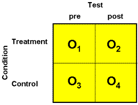
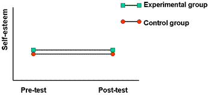
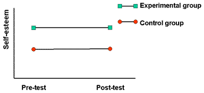
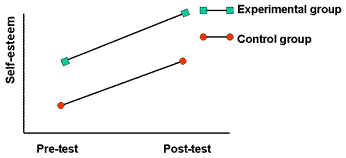
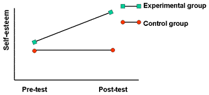
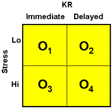
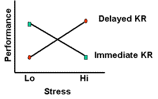

## 实验是什么  **What is an experiment?**

“实验”这个术语经常被用来描述包括收集数据的任何情况。我经常听到学生，甚至更有经验的研究人员，把各种不同的研究情况描述为“实验性”，而事实上他们不应该这样做。例如，研究人员可以使用一组参与者的两种新型有氧健康测试来收集生理数据，然后将这两个时间点的得分关联起来，以确定新程序的重测信度。这不是一个实验。再举一个例子。假设你想从一些不同的动机测量来预测对锻炼计划的依从性。您可以让参与者在计划开始时完成对动机变量的问卷调查，然后使用回归分析来确定其对日后遵守计划的影响。这也不是一个实验。本课将告诉你为什么。

## 设计与分析 **Design and analysis** 

从一开始就认识到，虽然在你的学位课程的第二年，我们分别教授研究设计和统计，但实际上它们是同一枚硬币的两面。 即使设计良好的研究，您也需要分析数据以确定任何变化、差异或关系在统计上是否显着。 相反，世界上所有的统计都不能帮助你从一个设计不好的研究中得出有效的结论。 在规划和设计一项研究时，要牢记如何分析获得的数据是至关重要的。 我忘记了最后一年的项目学生来帮我分析他们的数据的次数，只是失望地发现他们不能回答他们打算的问题，因为这个研究没有被正确设计。 设计和分析之间的关系也将在本课中进行说明。

## 因果关系 **Causation**

首先，我们来考虑一下实验的目的。回想一下关于科学本质的前一课。我们在那里了解到，科学的一个主要目标（许多人会认为最终的目标）是确定什么导致了什么。如果我们知道什么原因会发生，那么我们可以介入（或者不会发生，如果这是我们想要的）。例如，如果我们知道什么原因导致肌肉浪费在类风湿关节炎患者身上，我们可以进行干预来预防它；如果我们知道什么原因导致运动员对竞争情况更有信心，我们可以实施一个培训计划来帮助他们保持信心，等等。

所以我们要做的就是评估下面这个简单的命题：
$$
If   X, then  Y
$$
换句话说，如果给予这个治疗（X），那么这个结果（Y）应该发生。然而，只通过实施治疗之后的结果变化是不足以证明X实际上导致Y的。除治疗外，可能还有许多其他原因导致Y的变化。假设我们想知道一个心理训练计划是否导致运动员竞争状态焦虑的减少。我们派出一批运动员参加该项目，并在训练期间和之后的比赛中评估他们的焦虑情绪。我们观察到的任何焦虑减轻可能是由于其他因素造成的。参与者可能只是习惯于通过在培训期间参加的活动中获得的经验来应对竞争压力。

为了确定它确实是X导致Y而不是别的，我们必须同时测试两个命题：
$$
If X, then Y \\

and \\

If not X, then not Y
$$
因此，如果我们有两组运动员，其中一组接受了心理训练，另一组则没有，我们发现只有训练组的成员表现出焦虑减少（或者比没有治疗组减少更多）那么我们可以得出这样的结论，那就是这个计划导致了这些结果上的差异。这样可以吗？假设我们的心理训练组的运动员在训练期间有很多比赛，而没有处理的运动员只有几个。这可能仍然是比赛的经验，导致焦虑减少，而不是培训计划。或者，假设我们已经将更多的经验丰富的运动员分配给了训练组，而没有经验的运动员分配给了未处理组。开始的时候，更有经验的运动员可能已经具备了更多的精神技能，并且不太担心竞争事件。因此，为了得出治疗（X）导致结果（Y）的结论，我们还必须确保在该项目过程之前或过程中对Y的操作没有其他影响。我们必须把X的影响与其他潜在的影响分离开来。

那么，我们如何确定X实际上导致了Y？那么，为了确定因果关系，必须满足三个条件。我把这三个步骤称为因果关系：

第一步是证明因果关系的一个必要但不充分的条件。 如果X导致Y那么显然他们必须是相关的。 如果吸烟导致癌症，那么吸烟必须与癌症有关。 但是，仅仅因为两件事情是相关的，所以并不意味着一件事导致另一件事。 你应该已经在统计中遇到了这个想法。 统计上，我们可以通过关联来确定两件事是否相关。 但是，相关性本身不能确定因果关系。 如果X和Y是相关的，那么X可能会导致Y，但是同样的，Y可能导致X.或者，X和Y只是相互关联的，因为它们都是由别的东西（Z）引起的。 这被称为虚假关联(**spurious correlation**)：

例如，鞋子大小（X）和语言技能（Y）在儿童中高度相关。 这并不意味着大脚会导致孩子更熟练。 两者都是由相同的因素造成的，我们可以称之为成熟（Z）。

第二步也是证明因果关系的一个必要但不充分的条件。在我们对宇宙的正常经验中，我们并不期望效应在其原因之前出现。如果我们发现X在时间Y之前，至少我们可以排除Y引起X的另一种假设。所以虽然这个步骤不能确定因果关系，但它确实使我们更接近于确定X引起Y.为此在两个时间点收集数据的纵向设计的原因通常比横截面设计更强，在这种设计中，所有数据都是在同一时间点收集的。

因果关系的最后一步涉及实验。我们操纵（或改变）X，以便看看我们是否在Y中得到了一个改变。通过你的统计训练，你将知道在这种情况下，X被称为自变量，Y被称为因变量（因为值Y的水平取决于X的水平）。

## 实验操作  **Experimental manipulation**

术语“实验”可以定义如下：

>An experiment is a study in which at least one variable is manipulated and units are randomly assigned to the different levels of the manipulated variable(s).    Pedhazur & Schmelkin (1991)

从这个定义中，我们可以看到有两个重要的条件必须满足，才能把研究称为实验。 第一个条件是我们必须操纵至少一个独立变量来创建不同的情境。 正如在上面的心理训练例子中，我们可以给参与者分配两个条件之一：一个接受该程序的治疗组和一个没有接受该程序的无治疗（控制）组。 因此，独立变量（治疗）通过创建两个情境来操纵：接受治疗而不接受治疗。

## 随机分配  **Random assignment**

其次，我们必须确保这些群组之间没有系统的差异，否则可能导致治疗的结果发生变化。 换言之，我们希望这两个群体对于结果的任何影响，除了他们是否接受治疗之外，都是等同的。 通过这样做，我们可以将治疗的效果与其他任何潜在的影响结果隔离开来。 这样的其他影响被称为潜在的独立变量，因为它们是可能导致结果变化的因素。 这种“滋扰”变量的另一个术语是混淆变量( **confounding variables**)，因为它们混淆了研究中的结论。

我们通常通过随机分配参与者（上述定义中的 units）到不同的治疗条件（自变量）来实现组的等价。 我们的运动员样本必然会在很多方面发生变化：一些运动员会比其他运动员更有经验，有些运动员会参加更多的比赛，自然而然地不易焦虑，更聪明，有更好的辅导支持等等。 所有这些因素都可能影响结果。 通过随机分配运动员到两组，我们可以确保他们在这些因素方面上基本等同。

请注意，我只是说“基本等同”。事实上，随机分配到不同组的两个（或更多）个人组在所有方面不可能都是完全相同的。当随机分配时，我们依赖于由于概率规律的假设，个体之间的任何差异将是均匀的。因此，通过随机分配获得的组被称为概率等价(**probabilistically equivalent**)。换句话说，他们在概率上是相似的。团队的相似和随机化过程相当。当然，在小样本情况下，这可能是纯粹偶然的，两组之间有区别的可能性更大。因此，只要有可能，使用随机化来分配组是一个好主意。你可以通过测量这些变量来进行测试，然后测试一下这些组是否与它们有显着不同。例如，假设年龄在一项研究中可能是一个混杂的变量。你可以很容易地检查研究组的平均年龄有没有显着差异。

然后，操纵自变量和随机分配组是实验的关键特征。 没有这两个特征的研究都不是一个实验。 在本课第一段给出的例子中，没有操作变量，也没有随机分配给组。 这就是为什么这些研究不是实验。

**一个真正的实验涉及操纵自变量，同时保持所有其他潜在的自变量不变，并随机分配到自变量的不同组。**

**任何其他类型的研究不是一个实验！**

回想一下之前的抽样课程，我们需要区分随机分配到组和样本的随机选择。 对群体进行随机化并不意味着你有一个代表你感兴趣的人群的样本。为了对群体做出有效的推断，你仍然需要获得一个有代表性的样本。

## 准实验 **Quasi-experiments**

虽然真正的实验是确定因果关系的标准方法，但不幸的是，直接操纵自变量或随机分配参与者到不同的群组并不总是可能的。 没有人进行真正的实验来证明吸烟会导致人类癌症。 原因很明显， 你不能随意指定人吸烟二十年，然后看看你的吸烟组是否有较高的癌症发病率。 同样，人的一些属性是固定的，不能被操纵。 如果我们对性别对某些结果的影响，我们不能随意分配个人为男性或女性。

这并不意味着我们不能解决这些问题。 我们仍然可以通过使用所谓的准实验设计来将真实实验的原理应用于这些情况：

> A quasi-experiment  has all the elements of an experiment, except that subjects are ****not randomly assigned to groups.                                        Pedhazur & Schmelkin (1991)

在一个准实验中，自变量不是由调查者直接操纵的。 相反，自变量在某种程度上是自然发生的，或者已经通过一些超出研究者控制的过程而发生了变化。 例如，假设我们研究不同性别的肌肉损伤的差异。 尽管我们不能随机分配男性和女性的参与者，但我们仍然可以比较男性和女性对肌肉损伤的反应。 这被称为非等组设计，并且被广泛使用。 这个设计的主要问题在于，由于这些群体是非等价的，除了自变量之外，它们在很多方面都会有所不同。 因此，在因变量中观察到的任何差异都可能是由于这些其他潜在的自变量。 我们可以尽量减少，但不能完全消除此问题。

另一个常见的准实验设计被称为断点回归(**regression-discontinuity**) 设计，或者更简单地说是截断设计。这涉及根据他们在预处理变量上的分数给参与者分组。例如，您可能想要比较治疗对个体焦虑高或低的影响。您首先要测量他们的特质焦虑，然后根据预定的截止点将参与者分配到高和低组。通常使用中值分割程序。首先计算截止变量上总样本的中位数。然后，将所有那些得分低于中位数的参与者分配给“低”组，将那些得分高于中位数的得分分配给“高”组。问题在于，如果分数正常分布（应该是这样），大多数人都会在中位数附近得分。所以，你只是把那些刚刚高于中值“高”的那些和那些刚刚低于中值“低”的那些称作实际上相当平均的那些。另一种方法是采取更多的极端截断，分数分布的顶部和底部三分之一，并从研究中消除中间的分数。那么问题是，你必须丢弃大量的数据，你会收集相当大的麻烦。

> 对于断点回归，[这里](https://wenku.baidu.com/view/e65c8ba965ce050876321346.html)有个讲解更透彻的例子：如果我们想知道上“一本”是否对学生未来工资有影响，使用RD方法，就是观察那些在一本线上下2分的学生，看“上一本”和“没上一本”的学生的未来工资差异。这个想法的天才之处在于，高考的上下5分，实在是一件随机性非常大的事情。让这批学生重新考一次，不少学生的情况可能就要逆转。对于这5分区间内的学生来说，一条一本线，就像一个天然的分割线，将两组人随机分开了。

## 设计符号 **Design notation**

坎贝尔和斯坦利（Campbell and Stanley，1963）引入了一个简单的符号系统来描述不同类型的设计，我们将在下一节中使用。

**观察** Observations

观察或测量由O表示。下标用于表示特定的测量时机（例如$O_1,O_2$）

**操纵变量**  Treatments

自变量（治疗，操作，干预，训练程序或任何你要操纵的事情）都由X表示。在同一研究中的不同治疗由下标表示（例如$X_1, X_2$）。 一个没有治疗的条件空白表所示。

**群组** Groups

不同小组在不同的行。 连续的X和O适用于同一组。 例如，有两组，将会有两行。

**分配组**   Assignment to groups

随机分配由R表示。非等价组由N表示;；截止分配的组由C表示

**时间** Time

从左到右的维度表示时间顺序。 例如，O1 X O2表示观察，治疗，然后是第二次观察。

## 设计类型  **Types of design**

基本上有三类设计：实验，准实验和预实验（有时称为非实验）。 以下决策树可以帮助您确定在研究中使用哪种类型的设计：

现在我们来看看这些不同设计分类的一些具体例子。 这些设计代表了基本应用； 他们有更复杂的变化。 我们将在下一课中继续研究主要设计的具体优缺点。

### 预实验设计  **Pre-experimental designs**

####  1. 案例研究 **One shot case study (posttest only design)**

所有的最简单的设计，案例研究可以用我们的符号系统来描述：
$$
X--------O
$$
我们只有一组参与者，给他们一个治疗（操纵自变量），然后测量其（所谓的）效果。 例如，我们可能会给一些群体增加体力活动的动机，然后衡量他们的锻炼量。 这种设计在证明治疗的因果效应方面的弱点应该是显而易见的。 由于我们没有衡量参与者在治疗前做了多少锻炼，我们怎么能说出治疗是否导致了改变？ 而且，如果他们没有接受治疗，我们不知道他们可能做了多少活动。

这并不是说这样的设计毫无用处。 假设你对英格兰退出世界杯决赛对人们情绪状态的影响感兴趣。 事件发生后，通过访问个人可以获得有关人们情绪的有用信息。 但是你不能从数据中得出任何的因果影响。 你不能确定这是英格兰退出，而不是其他因素，决定了样本的情绪状态。

#### 2.单组，前测，后测  **Single group, pretest, posttest design**

$$
O_1--------X---------O_2
$$

有了这个设计，我们可以确定治疗和因变量一起变化。 但是，我们仍然不知道是不是治疗导致了变化，为什么不是其他因素，因为我们不知道没有治疗，效果是否会改变。 在这里，我们正在测试最早提出命题，如果X那么Y，而不是另一半：如果不是X，那么不是Y。

#### 3. 静态组比较  **Static group comparison**

$$
N----------X---------O_1\\
N----------X---------O_2
$$

这是一个没有重复措施的准实验，非等价组设计的例子。 经历过治疗（或事件）的组与未接受治疗的组相比较。 例如，在英格兰退出世界杯之后，我们可以将对足球感兴趣的人的情绪状态与对足球不感兴趣的人的情况进行比较，推断这种情况只会影响喜欢足球的人的情绪。 但是，如果没有预先测试，我们无法知道在没有发生事件（或治疗）的情况下他们是否会有所不同。

### 真正的实验设计  **True experimental designs**

#### 4.随机前测 - 后测对照组设计  **The randomised pretest-posttest control group design**

$$
R---------O_1---------X---------O_2 \\
R---------O_3---------X---------O_4
$$

也常被称为随机控制试验(RCT：**randomised controlled trial**)，特别是在医学研究中，这是原型实验设计。因此，我们将花费大量的时间来了解它和它的一些变化。在其基本应用中，参与者被随机分配到治疗或对照条件，并且在基线（即在治疗实验组之前）和之后处理两组中测量因变量。通过这个设计，我们可以确定我们的基本命题的两个方面：如果X，那么Y，如果不是X，那么不是Y.它的优点在于我们可以：

（a）确定这些组在基线是否相等（至少就测量的因变量而言）。

（b）确定是否是治疗导致实验组的变化，而未应用治疗时的对照组未观察到的因变量的变化，或治疗导致因变量的变化比没有治疗的变化更大。

这个设计有很多变型。 例如，您可以进行进一步的后续观察，以便日后可以看到在治疗后因变量的任何变化：
$$
R---------O_1---------X---------O_2------------O_3\\
R---------O_4--------------------O_5------------O_6
$$
除了控制条件外，您还可以有两个以上的实验条件或组。 例如，您可能想要比较两种不同类型的有氧训练计划的效果，或比较强化的训练计划与不密集的计划的效果：
$$
R---------O_1---------X_1---------O_2\\
R---------O_3---------X_2---------O_4\\
R---------O_5--------------------O_6
$$
此外，前测后测设计通常作为准实验设计应用，没有随机分配条件。 例如，可以通过比较男性和女性，经验多少d的运动员，或根据某些标准的高分和低分创建小组。 在这种情况下，很明显，我们就会遇到非对称的问题。 我们将在下一课中更深入地讨论这个问题的后果。

#### 5.后测只控制组设计  **The posttest only control group design**

在这个设计中，参与者被随机分配到组，但都没有得到预先测试：
$$
R---------X---------O1\\
R--------------------O2
$$
在这里，我们假设随机化在预测试中将这些组等同起来。 设计看起来可能比以前更弱，但事实上它有两个明显的优势。 一方面，实施成本更低，耗时更少，因为只有一半数据需要收集。 它还具有设计优势，我们将在下一课中进行讨论。 当然，这个缺点是我们没有检查这些组在预测试中因变量是否一样。

#### 6.所罗门四组设计  **The Solomon four group design**

这种设计是以前设计的组合：
$$
R---------O_1---------X----------O_2\\
R---------O_3--------------------O_4\\
R--------------------X----------O5\\
R-------------------------------O6
$$
所有的小组都进行了测试。 一组进行前测并得到治疗;；一组进行了前测，但没有得到治疗； 一组不进行前测并得到治疗；一组未经前测，未得到治疗。 这个设计结合了所有的可能，因为它既保留了以前设计的优点，又没有缺点（在下一课中更多地介绍了这一点）。 然而，从实际的角度来看，实施成本高，费时，需要更多的参与者。

## 结果和分析  **Outcomes and analysis**

现在来看看实施基本的随机前测后测控制组设计的可能结果以及设计如何与数据分析相关。 为了使这个更具体，让我们假设我们正在研究一个有氧运动项目对自尊的影响。 我们随机分配参加者治疗（每周两次，一小时的有氧运动三个月）或没有治疗控制条件，并测量他们在基线（前测）和培训后（后测）的自尊。 自变量是组（有两个层次：治疗和控制）和测试（有两个层次：前和后测）。 因变量是自尊。 我们可以像这样描绘设计：

正如你所看到的，方框中的每个单元格代表一个观察或测量，每个组的前后测。我们需要确定三件事情：

1.这些组在前测时是否一样（治疗之前的自尊组之间没有差异）？这是测试O1与O3。

2.其中一个或两个小组随着时间的推移而变化吗？ （O1对O2和O3对O4）。

3.后测组是否有所不同？ （O2对O4）。

如果我们假设治疗会增强自尊，那么我们希望看到：

1.训练前两组之间没有差异。

2.治疗组改善但对照组不改善或治疗组改善程度高于对照组。

3.治疗组在测试后分数高于对照组。

分析数据。选择的分析可能是方差分析。具体而言，我们将进行双因素方差分析，重复测试。 ANOVA实际上并不是分析这个设计数据的唯一方法，但它是您熟悉的方式，所以我们会坚持下去。该设计可以被描述为混合模型ANOVA。混合模式，因为它包括主体效应（参与者之间的时间差异）和主体效应（参与者在前后测试之间的差异）。

**1. 没有结果 The null outcome**

第一个可能的结果是没有任何反应。这两个群体的自尊评分都没有变化。当以图形方式显示时，结果如下所示：

显然，治疗没有效果，方差分析不会产生显着影响。

**2. 时间是主要影响 Main effect for time (within subjects)**

两个群体的结果以同样的速率提高。这里的治疗对改变本来就没有影响。请注意，改变的方向可能是相反的：两组的自尊可能随着时间的推移而降低。这仍然是一个时间的主要影响。

**3. 群组的主要影响 Main effect for group (between subjects)**

实验组在前测和后测中均高于对照组，但两组均未随时间变化。 这表明：（a）随机分配不起作用（自尊水平不是随机分布在两组之间）;（b）治疗没有效果。

人们不得不质疑为什么随机分配不起作用。 在实验组中，可能纯粹是一种自尊心较高的个体出现的机会。 或者，实验组中的一个或两个个体在前测试中得分特别高，并且这些分数影响了组的平均值（或者对照组中的一些个体具有特别低的分数）。 这样的个人被称为离群值。 在进行分析之前，您可以筛选异常值，如果发现任何异常值，则从数据集中消除它们是合理的。 例如，您可以消除所有样本平均值以上三个或更多标准偏差的情况。

**4.时间和群组的共同影响 Main effects for both time and group**

这两个因素都有可能产生主要的影响。在这里，这些组在前期和后期测验中都有显着差异（再次表明随机化不起作用），并且随着时间的推移，两组都有显着的改善（表明治疗没有超过本来会发生的效果）。这个变化可能是在另一个方向。

**5.X组测试交互 Group X test interaction**

当然，我们真正想要的只是在治疗组自尊方面有所改善，或者治疗组的改善比对照组有更大的改善。 这样的结果看起来像这样：

显然，图表显示，这些组在前测中没有差异，对照组的自尊水平没有变化，但治疗组的自尊水平有所提高，这导致了后测组之间的差异。

我们现在可以肯定地说，治疗是有效的吗？那么，好像还不能确定。这取决于排除观察到的变化（潜在的自变量）的任何其他潜在的解释。这是我们将在下一课中处理的事情。同时，你能想出这些发现的任何其他解释吗？

交互可以采取多种不同的形式。例如，一个普遍的发现是两组都改变了，但治疗组的改变比对照组更多。如果我们能排除潜在的混乱，我们可以说，治疗的效果超过了没有治疗就会发生的事情。我们将在本课的后面看看另一种特殊的交互形式。不管他们采取什么样的形式，但是当你画出结果的时候，你知道你有一个互动，就像我们在这里做的那样，线条不平行。请注意，在主效果图中，线条总是平行的，无论它们的整体形状如何。考虑到我们现在的例子，想一想你可以找到多少种不同的交互形式，以及你如何解释它们。

##  **Fully within subjects designs**

到目前为止，我们一直在研究混合模型设计，参与者被分配到不同的治疗组。 有时我们想要评估几种不同的治疗方法或不同的治疗效果。 例如，在一项运动控制研究中，我们可能想要确定不同反馈量对技能表现的影响。 我们可以将参与者分配到不同的小组，每个小组接受不同的反馈，使用随机前测后测设计。 然而，更有效的方法是让同一组参与者进行各种治疗。 这消除了组间变异所产生的任何“噪音”，使得我们更有可能在那里找到效果。 这样的设计有时也被称为完全重复的措施设计(**fully repeated measures designs**)。 在设计符号中，有两种治疗的研究可能如下所示：
$$
R---------X_1---------O_1--------------X_2---------O_2
$$
这种设计的一个问题是第一次治疗的效果可能会影响第二次治疗的反应。 这被称为顺序效应(**order effect**)。 这可以通过抵消来防止：一半的参与者先做X1再做X2，而另一半先做X2再做X1。

这里有一个这样的研究的例子。 假设我们研究复杂任务的即时或延迟影响。 我们让参与者用即时KR( knowledge of results)执行任务，观察它们，然后让它们再次执行延迟KR并再次观察它们：

KR类型的呈现顺序是平衡的。这是一个单一的因素的设计，并将通过重复测量单因素ANOVA分析。

### 双因素的例子 **A two factor example**

设计可能比这更复杂，并且有许多不同的因素。 假设，立即与延迟的KR的影响不同，取决于参与者是否处于压力的情况。 这里我们有两个因素：KR的类型和压力与没有压力。 具体而言，我们假设，当参与者受到压力时，在延迟KR下，表现会更好，但在没有压力的情况下，在即时KR下更好。 我不知道这个假设有什么好的理由，但是，嘿，这只是一个例子！

因此，我们让参与者在高低压力条件下以延迟和即时KR进行表演。 再次，我们平衡，以避免秩序的影响。 我们可以像这样描绘设计：

如果我们的假设是正确的，绘制结果如下图所示：

你可以看到，当在低压力条件下立即给予KR表现比在高压下更好。 相反，当给定延迟KR时，在高压力条件下性能更好。 有显着的KR类型与压力的相互作用。 这种交互形式被称为交叉交互(**crossover interaction**)。

## 结论 **Conclusion**

我们现在讨论因果关系，我们已经涵盖了一系列的基本设计和设计原则，并且展示了最常见的设计如何与数据分析相关。 不过，这其实只是故事的一半。 我们仍然必须考虑如何排除一些潜在的独立变量或混杂变量影响实验结果的可能性。 我们还没有考虑究竟为什么或如何正确实施实验设计，使我们能够归因于因果关系。 这些是关于研究的有效性的问题，我们将在下一课中讨论。

