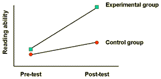
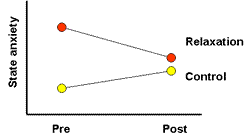

## 内部有效性和外部有效性 Internal and external validity

在第四课（实验设计）中，我们介绍了潜在的自变量问题：可能会有一些导致因变量变化的非受控因素。这些因素被称为研究的**内部有效性威胁**(**threats to the internal validity**)。因此，内部效度与研究的设计在多大程度上使我们将因果性归因于自变量并排除了潜在的其他解释。研究者的任务是设计研究，排除合理的替代解释，以确定是造成这一效应的自变量。

> 内部有效性就是说，研究的目的就是为了确定因变量的变化只受自变量影响，排除其他的不受控因素。国内也有人翻译为内部效度是因变量和自变量之间关系的确实性程度，是实验结论的真实性。

研究有效性的第二个方面涉及研究设计在多大程度上允许我们将结果推广到非抽样样本的人群，或不同环境或不同时间的类似人群。这被称为外部或生态效度(**ecological validity**)。外部效度是关于应用于现实世界的结果是否有意义。

>外部有效性，或者叫外在效度(external validity)是指研究结果的代表性或普遍性。具体说来，就是指研究结果是否可以推广到类似情景中去的程度。

**内部有效性**（**Internal validity**）：研究设计在多大程度上可以将因变量的变化归因于自变量的变化？

**外部有效性**（**External validity**）：我们可以在多大程度上将研究结果推广到其他人或环境？

在本课中，我们将详细研究有效性面对的主要威胁以及不同的研究设计如何对其进行控制。从一开始就要注意到，需要考虑研究的特定环境来评估不同有效性威胁的可能性。在某些情况下，特定威胁可能根本不适用。

对有效性的威胁可以大致分为三类：与时间流逝(**passage of time**)相关的威胁，与参与者选择( **selection of participants**)相关的威胁以及与测试和操纵相关的威胁。后一类包括反应性安排，将分开处理的多种威胁。

## 与时间流逝有关的威胁  **Threats relating to the passage of time**

与时间的流逝相关的威胁无论何时使用重复的措施设计都是潜在的问题。 这个类别有五个主要的威胁：成熟(**Maturation**)，历史(**History**)，死亡率(**Mortality**)，仪器(**Instrumentation**)和统计回归的平均值(**Statistical regression to the mean**)。

### 成熟(**Maturation**)

这种威胁与时间的推移有关，例如发展变化，衰老，饥饿，疲劳等。例如，假设一位教育研究人员有兴趣评估8岁儿童使用新的阅读方法的效果。 研究者考虑使用一个单一的组，前测(pretest)后测(posttest)设计：

​                                                                 O1                                X                               O2

对一类儿童的阅读能力先进行评估测量，进行一段时间的新方法阅读的课程，再对阅读能力进行评估测量。 **这个设计有什么问题？**

很明显，不论具体的教学方法如何，孩子的阅读能力都会随着时间的推移而改善。 因此，在前后测量之间观察到的任何改善可能是由于人本身成熟：儿童自身认知的变化。 新方法可能是有效的，但是我们不能把它的影响与那些已经发生的影响区分开来。

意识到他的错误后，研究人员决定采用随机前测后测控制组设计：

​                                                    R                                 O1                       X                       O2
​                                                    R                                 O3                       X                        O4

儿童被随机分配到两组中的一组。 一组接受阅读课程，另一组接受“标准”教学方法。对这两个组的阅读能力进行前测试和后测试。 **这是如何控制成熟的影响？**

假设结果提示新的教学方法优于标准方法：

两组阅读能力都有所提高，但接受新教学方法的实验组提高得更多。由于孩子是随机分组的，所以应该在阅读能力和其他相关因素上应该是相同的。因此，任何发生的成熟的变化将同样适用于这两个群体。对照组的改善是由于正常的年龄变化，而实验组的更大的改善则可归因于新的教学方法，只要在操作中没有其他潜在的自变量（有效性威胁）。例如，管理新教学方法的人只是一个更好的老师，或者比使用标准方法课程的人更有动力，更热衷于使用新方法的前景。正因为如此，实验组的人员才能以更快的速度发展。**那你怎么能避免这些潜在的影响因素呢？**

*要想完全避免是很困难的！当然，你可以让同一位老师使用这两种不同的方法教学，但是再一次，他们可能会更有动力使用新方法。 在某些情况下，比如医药领域建立的研究可以使实验者不知道他们正在提供哪种治疗以避免上述提到的问题。例如，在评估新药疗效的医学研究中，采用双盲(**double-blind**)程序是正常的：参与者本身和实验者都不知道参与者是否正在接受药物（或药物的剂量）还是安慰剂（即没有药效的试剂）。但是显然，在这个例子中你不能用这个方法。 老师怎么会不知道他们使用了哪种教学方法？ 如果你能想到一个方法来解决这个设计问题，你将会对科学做出重大贡献！*

>成熟(**Maturation**)我们可以理解为参与实验的人自身的年龄的变化会导致认知等的变化，如果试验周期长，这种变化是研究者无法避免的。现在面对这个问题，主要的方法就是使用双重差分模型（difference-in-differences model），就是第二个改进的设计。这在预测问题中经常出现，比如我们要考虑汽车的销量，那么我们第一个要避免的就是随着年份的增长，经济形势的好转，汽车销量自然是增长的，首先要将这个原因排除在外。

### 历史(**History**)

历史是指除了可能影响因变量的实验操作之外，在事前和事后测试之间发生的事件。成熟(maturation )效应是参与者自身发生的事件(happening **within** participants)，历史效应是除了实验人员的干预因素外，发生在参与者身上的事件(happening **to **participants)。

举一个例子，假设一家大公司决定推广健康饮食，减少吸烟和增加劳动力的体力活动。为推行这些与健康有关的行为而给予工人财政奖励。该方案通过测量实验之前和之后随机抽取的工人样本的饮食，吸烟和活动习惯来评估。在这里，我们有一个单一的组，再次进行前测后测设计。假设在该计划运行的同时，地方卫生当局开展了针对整个社区的重大健康促进举措。这些举措包括提供关于健康生活方式的信息和建议，通过当地超市，休闲中心，媒体等宣传。在这里，我们有一个可能影响公司方案结果的历史事件。劳动力队伍中的任何健康行为的改善都可能是由于他们所面对的更广泛的社会的健康促进举措，而不是公司的财务激励。

随机对照组设计（有或没有预先测试）的历史威胁完全相同，正如他们控制成熟的影响一样。如果这些组通过随机分配进行了前测，那么任何历史效应都应该平等地影响这些实验组。因此，除了由于历史事件而在对照组中观察到的任何变化之外，实验组中的任何变化都可以归因于自变量。

> 这个已经不算是什么大问题了，随机对照组就可以避免这个问题

### 死亡(**Mortality**)

死亡威胁与前期和后期测试之间实验参与人员的退出有关。我们已经在采样课上遇到了这个问题。退出可能与留在研究中的参与者有着系统的不同。因此，当参与者退出时，样本的性质发生变化。在一个单独的小组研究中，这意味着在预测试开始的样本至少可以合理地代表感兴趣的人群，但是在后测中可能不具有代表性。例如，假设进行一项研究来检查激励强化治疗对坚持使用单一组的锻炼计划的效果，即前测后测设计。没有动力的参与者可能会退出，留下更多积极的参与者。任何明显的锻炼增加都可能是因为最后离开的参与者无论如何都有强烈的动机去坚持这个计划，与治疗可能无关。

但是，我们已经讨论了单组设计薄弱的两个原因，还有更多的原因。一个随机前测后测的对照组设计成什么样？在这里，和前两次的威胁一样，随机化也是为了弥补这个问题。如果参与者被随机分配到组，那么他们应该在动机和任何其他可能导致推出的因素上是相同的。因此，如果有推出的情况，同一类人应该会从两个群体中推出。

然而，死亡仍然可能会出现问题，特别是如果治疗费时或需要代表参与者的努力。假设我们使用随机前测 - 后测对照组设计实施了研究，以评估动机治疗对于坚持锻炼的有效性，并且使用包括参加四个一小时长的激励增强课程，另外还提供了一个遵守数据的锻炼课程。对照组不需要参加任何这样的课程，仅仅是练习课程。尽管这两组在初始随机化方面动机因素是等同的，但由于涉及的时间和精力，动力较小的参与者可能会退出治疗组。因此，治疗组缩小的方式与对照组无法比拟。对照组中有更多或更少动力的个体在后测中保持混合，但实验组仅包含更多有动力的个体。因此，在后测中治疗的任何明显的优势可能仅仅是由于参与者的动力而不是治疗。

所以，死亡率只有在群体之间没有差别死亡(**differential mortality**)（即不同类别的人从不同群体中退出）时才被控制。如果你做了这项研究，想想可能会有什么后果，而且你遇到了退出，但没有差别死亡率。这可能导致其他的问题吗？

*这里的问题是，虽然这些群体的性质可能没有差别，但它们将会发生变化。 假设有些人从两组中推出，人数相似，因为他们觉得练习课太难了。 现在对操控变量的任何明显的优势只适用于那些没有发现这些课程太难的人（比如更有动机的人，更合适的人，或者已经习惯了的人等等）。 这意味着我们不能把结果推广到为动机不强，不适应，不活跃的人。 那么在这种情况下，我们就有一个外部效度的问题：不能将我们的研究结果推广到其他类型的人。*

### 仪器(**Instrumentation**)

通常情况下，这是一个更直接的威胁。当测量因变量的方式在试验前和试验后或者在不同组之间有变化时，这是一个问题。这可能是由于仪器的校准错误，使用不同的仪器，或者由实验者以不同方式使用仪器所致。

在我以前作为医院手术室技术员时，我曾经测试过五个电子血压计，都是同样的品牌。他们给了五个不同的读数，变化多达10毫米汞柱！假设我在研究中使用它们来评估放松对血压的影响。我使用一个组，前测后测设计。在预测试中，我碰巧使用了一个低于在正确的值5毫米汞柱的测量仪，而在后测中我使用了一个测量值超过正确值的5毫米汞柱的测量仪。即使实际上治疗已经使血压降低了5毫米汞柱，我也不得不得出结论，放松实际上会增加血压！因此，教训是，确保您使用的是正确校准的仪器。

如同观察性研究，当研究人员本身就是仪器时，仪器也可能是一种威胁。假设进行一项研究来评估训练教练是否给予正面的反馈，实际上是增加了他们对正面反馈的使用的机会。我们通过观察员在训练期间记录实例来评估提供的积极反馈，然后我们给予治疗，并再次观察教练，看看他们是否使用更积极的反馈。假设实际上培训没有效果，教练对积极反馈的使用不会增加。你能想出为什么观察者可能会在后测中记录更多正面反馈实例的原因吗？

*观察员可以更加熟练地注意和记录正面反馈的情况，因为他们有更多的观察教练的经验，因此即使实际上没有变化，他们在后测中也会比在前测中记录更多的实例。 由于这个原因，观察性研究通常使用多个的观察者，并在观察中训练他们，直到他们达到预定的一致性水平（回顾测量课的评价者间信度）。*

> 这种现象同样出现在数据分析中，特别是如果你的代码中需要随机值（比如在切分训练集和测试集时），请确保每次实验的随机值是一致的。另外，如果你需要记录实验时间，请确保你的计算机两次实验都在相同或类似的资源使用条件下。

### 统计回归的平均值(**Statistical regression to the mean**)

这是一个复杂的统计现象，可能发生在试验前后测量设计中。每当我们进行试验前测量时，因为某些在后测中不会出现的因素，有些人会在变量上得分较低或较高。那么当你采取后测方法时，那些人不会再得分那么低或者高。例如，假设我在本课中给了“研究方法”课多选题测验。你们中的一些人会做一些幸运的猜测，并给出你不知道答案的问题的正确答案，所以你的分数将被夸大（即蒙对答案了）。这样做的效果就是把课程的平均分数向上拖动。如果我稍后再给你们进行第二次相同的测试，那么第一次碰运气的人不太可能再做对。所以在后测中班级的平均值会更低（运气没有那么好，不可能每次都蒙对）。

许多因素可以产生这种回归假象。对于个人，可能只是觉得这一天很糟糕天，心情不好，没有集中注意力或者什么的，而且可能很难确定是什么导致了这个问题。当在一些准实验设计中根据前测的极端分数选择组时，统计回归极可能发生。回想一下，我们在前一课中讨论了这种方法（the **regression-discontinuity** or **cutoff** design）。这里的问题是，一些参与者只会在前测中得到极高的分数，这只是由于在后测中不会运行的因素（比如，运气）。当参与者被随机分配到组中时，回归不会是一个问题（提供随机化的工作），因为导致“误导性”极端分数的因素将随机分布在组中。

不幸的是，随机化并不总是奏效。我们曾进行过一项研究，评估松弛治疗对术前焦虑和麻醉困难的影响。将松弛治疗与在相似时间段中听短文（注意控制条件;稍后更多）和使用随机前测后测对照组设计的无治疗对照条件进行比较。当绘制时，放松和不治疗组状态焦虑的变化结果如下所示：

为清楚起见，我在这里省略了注意控制条件的结果。 他们一直在中间。 只要你看到这样的结果，就应该想起这些警告。 显然，尽管随机分配，这些群体在试验前的测试中焦虑并不相同。 因此治疗组的焦虑明显减少和对照组的增加可能归因于统计回归。 当我们把这项研究提交出版的时候，我们很快就指出了这一点。 幸运的是，我们还有其他数据来解释，并且这篇文章发表了。

## 与参与者选择相关的威胁 **Threats relating to selection of participants**

这些威胁涉及在多个小组研究中给参与者分配治疗条件时引入的偏差。

### 选择偏差  **Selection bias**

这种威胁涉及将参与者分配给群体时由差异选择产生的偏差。 如果一开始这些小组是不同的，那么在对其中一个小组实施治疗之后，无论治疗是否有效，他们很可能会有所不同。 例如，假设在我们放松术前焦虑研究中，我们将更多焦虑的参与者分配给控制条件，而不那么焦虑的参与者放松治疗条件，并使用静态组比较设计：

​                                                          N                           X                               O1
​                                                          N                           X                                O2

我们可能会发现，放松组治疗后焦虑不如对照组。 显然，这可能是因为放松小组无论如何都不那么焦虑。 很显然，随机分配到组可以避免这个问题，因为这些组在预测试中是相等的。

### 威胁可以相互影响  **Threats can interact**

在多组研究中，选择偏差可能与我们已经遇到的以及未来的威胁相互影响。 例如，我们可以选择X为成熟。 在这里，如果存在差别选择，则因变量的变化可能是由于一些群组中的成熟变化而不影响其他群组。 例如，如果一个治疗组的成员比对照组年轻，那么治疗组的任何变化都可能是由于成熟，而不是治疗本身。 或者我们可以选择X为历史。 在这里，如果存在差别选择，则因变量的变化可能是由于在另一组中经历的历史事件而导致的。 如果一组在预测试中是极端的（相对于总体均值），那么我们也可以选择X回归，而其他组则不是。

### 选择X  **Selection X manipulation**

选择X互动是相当不同的。在这种情况下，操纵的效果只适用于特定人群的抽样。因此这是对外部有用性的威胁。例如，大量的心理学研究已经使用本科生作为参与者，只是因为他们很容易掌握。然而，本科生与普通人群在很多方面有所不同。例如，人们希望他们比一般人更聪明，受教育程度更高。那么，我们可能会质疑，从本科生获得的结果是否适用于一般人群。

同样，在体育科学方面，大量的研究都使用竞技表现较低的体育表演者，因为很难有更多精英表演参与到我们的研究中来。假设我们发现当与较低水平的表演者进行测试时，一些干预“有效”。我们无法知道，除非我们继续用这种人群进行测试，否则同样的干预措施是否会对精英运动员有效。更进一步。如果我们继续在英超球员上测试干预措施，那么我们怎么知道同样的干预措施对顶级短跑运动员来说同样适用呢？无论内部有效性如何强大，没有设计可以回答这个问题。实际上，这是一个我们必须始终牢记的的普遍的外部效度问题。从逻辑上讲，我们不能将内部有效研究的结果推广到与用于测试干预的人群不同的人群（ **Logically, we cannot generalise the results of an internally valid study to populations other than the one used to test an intervention**）。但是，我们通常没有资源对每一个可能的人口采取干预措施。在结束的时候，我们必须对我们的发现在多大程度上能够推广到不同的人群进行一般化的判断。这就成了一个有效性的问题：从不同的人群中获得同样的结果是否合理？

> 采样结果能够视为普遍结果，在样本人群上的研究结果能否视为普遍结果。现在人们说大数据可以不用采样了，我们可以获取全部的信息，但是你确定你获取的是大数据？你的大数据是全部信息吗？

## 测试和操纵相关的威胁 **Threats relating to testing and manipulations**

这些威胁与测试参与者的行为有关，而且与那些预期行为不同的操纵的潜在影响。

### 测试 **Testing**

测试效果与在前测对于后测成绩的影响有关。后测分数可能受到前测行为的影响，即在记忆、熟悉测试设置等方面获得的练习的影响。 例如，提高智商分数的最好方法就是进行智商测试！ 通常情况下，从第一次IQ测试到第二次测试，分数提高了大约3-5分。 当然，这并不意味着进行智商测试会提高你的智力！

单组前测后测设计显然会面临这种威胁。 随着时间的推移，任何明显的变化可能只是由于采取了预先测试的行为，而不是由于任何干预。 那么随机前测 - 后测对照组设计怎么样？

*希望现在你已经得到了技能！ 如果参与者被随机分配到组中，那么测试效果将在所有组中均等地表现出来。 因此，我们可以确定操纵对实验组的影响，超过了测试本身的影响。*

### 测试的反应性影响 **Reactive effects of testing**

前测可以以更微妙的方式改变人们面对后测反应的方式。例如，假设我们让一些年轻运动员完成关于体育运动中毒品的态度问卷。填写问卷的行为可能会让他们离开，对体育药物的思考比以前更加深入。然后，如果您在以后再次提交同样的调查问卷，他们可能会以不同的方式回答预先测试的问题，而不考虑旨在改变态度的任何干预措施的效果。这也被称为预测试敏感性：预测试使参与者对干预敏感，以便他们以不同于没有参与预测的应答的方式做出反应。测试的反应效果实际上是预测试和干预之间的相互作用。这是对外部效度的威胁，因为如果根据我们的研究，我们认定我们的干预是有效的，那么当我们外出并在现实生活中应用干预时，我们通常不会预先测试个人。你能想到一个可以避免这个问题的设计吗？

*随机后测只控制组设计控制测试效果和测试的反应效果，因为没有预测试！因此，它可以比随机前测后测控制组设计（因为没有预测试致敏的可能性）提供显着的优势，当然，随机化将在预测试中的组视为等同的。*

*所罗门四组设计：*

​                                                    R                            O1                          X                   O2
​                                                    R                            O3                                                O4 
​                                                    R                                                            X                   O5
​                                                    R                                                                                  O6

也控制了测试的反应性效应，而且由于有一些小组既​​可以进行前期测试，也可以进行后期测试，因此可以确定干预前后干预期间是否有任何变化，没有干预（即由于时间的推移）。正如前面所讨论的，这是随机的只有后测试的对照组设计不可能的，因为用这种设计，我们不能说出对照组在没有干预的情况下随时间变化了多少，因为没有预先测试。*

*但是，正如前一课所述，所罗门设计的实施费用昂贵且耗时。*

## 反应性安排 **Reactive arrangements**

反应性安排不应与测试的反应性影响相混淆。这些是与参与者对研究背景的反应有关的更普遍的一类威胁。本质上，问题归结为：研究环境不是自然的情况，所以我们可能期望研究的参与者表现不自然。换句话说，研究设置可能会影响到参与者做出和现实生活中的不同的反应。

研究是一项涉及研究人员和参与者之间复杂的人际交往的社交活动。因此，反应安排有时被称为对有效性的社会威胁。与豚鼠或实验室老鼠不同的是，人类研究参与者正在思考，合理化生物，他们总是试图理解他们的情况，解释他们正在发生的事情，并预测他们的期望。这在心理社会研究情况下变得特别成问题。那么，社会对内部有效性的威胁关注的是由于研究背景中固有的社会因素而导致的因变量的变化。

举例来说，多年来一直有很多争论，是否有可能让人们在催眠下进行一些不催眠情况下的正常表现的行为。六十年代初期的一项研究似乎支持这一观点是可能的。催眠的参与者被告知要拿起毒蛇来玩耍，他们正是这样做的。当然，毒液之前已经从蛇身上移开，但参与者不知道这一点。 Orne和Evans（1965）然后复制这个研究，但没有催眠并且得到相同的作用！当被问到为什么他们做了这么看似危险的事时，与会者回答说，他们知道实验者是负责任的人，他们不会真的把他们置于危险之中。在类似的研究中，奥恩和他的同事设法让参与者犯下各种显然危险甚至是暴力的行为，比如向他人的脸上扔“酸”（实际上只是水）。参与者在实验环境中的表现往往不像平时那样行事，早期实验的结果可能不是由于操纵（催眠）而是由于参与者对情况的认识。

重要的是要指出，反应性安排不仅是实验研究中的潜在问题。任何研究设置是不寻常的，可能会提示参与者的非特征性反应。如果我拦下了High Street的人们并要求他们填写一份问卷，这对他们来说是一个不寻常的情况，他们可能以不寻常的方式行事。

> 实验参与的人既然已经知道了他们是在实验中，那么他们极有可能做出一些与正常生活中不同的事情。

## 动机问题 **Motivational issues**

每当参与的研究耗费时间，乏味，涉及厌恶的程序，需要经过努力等时，参与者在研究过程中可能失去动机或失去动力，从而影响他们的反应。此外，涉及威胁个人自我的程序或需要披露个人信息的程序可能导致他们以不完全诚实的方式作出回应。

一个相关的问题是社会适宜性反应偏差(**social desirability response bias**)。这是一个衡量问题。人们通常倾向于尽可能以最好的方式描绘自己。他们可能不愿透露自己的恐惧或弱点。所以他们可以用他们认为是社会上可取的或可以接受的方式来回应。如果我要问“研究方法”课程，你们中有多少人会挖鼻孔，我敢打赌，你们当中的所有挖鼻孔的人都不会承认。作为一个更严肃的例子，运动员可能不愿意表现出竞争焦虑的感觉。因此，当给予焦虑问卷时，他们的得分可能低于他们真实情况。同样，当被要求汇报身体活动水平时，个体倾向于高估他们自己。他们也许不希望被视为懒惰。在重复测量的随机多组研究中，如果我们假设过度或者低估的倾向是随机分布在群体之间，那么这不是一个大问题。尽管获得的绝对分数是不准确的，但我们仍然应该能够检测到不同时间的差异性变化，因为不同组别的人可能会在不同的场合高估或低估。

社会适宜性反应偏见是一种相对稳定的人格倾向。有些人比其他人有更好的社会回应的倾向。调查问卷受社会需求响应影响的可能性可以在其发展过程中进行评估。量表可用于衡量以社会期望的方式作出反应的倾向，最显着的是Marlowe-Crowne量表。这要求个人对一系列陈述作出真实或错误的回答。对于一些声明，期望任何人如实或积极地作出回应是极不可能或不合理的。例如，一个声明说“我从不生气”。由于大多数人在某些场合都会生气，因此期望有人对此陈述作出“真实”回应是不合理的。如果他们这样做，那么他们很可能会以社会愿望回应的偏见作出回应。我们可以用两种方式来使用这个量表。我们可以用一个新的问卷来管理它，并将这两个方法的分数联系起来。一个显着的相关性表明新的问卷容易出现这种反应偏差。其次，我们可以通过管理Marlowe-Crowne量表来识别那些倾向于以社会期望的方式做出反应的人，并将他们从我们的研究中消除。为了这个目的，许多人格库存都包含了类似的物品，称为撒谎量表( **lie scales**)。

没有设计本身可以控制动机和反应的偏见因素。我们只能尽量减少它们。经常用来维持动机的方法是为参与者提供奖励，例如金钱，学生参与者的课程学分或者参加抽奖的机会。你能想到这个问题吗？

*参与者可能会以不同于他们在日常生活中的反应的方式回应，因为他们正在为奖励或奖励而努力！ 所以这样的激励措施可能会引入反应安排威胁*

给予参与者的指令称为教学集(**instructional set**)，可以用来向他们保证他们的答复将被严格保密，除了用于回答研究问题之外别无他用。理想情况下，应该在匿名的情况下进行问卷调查和其他措施：没有名字被采纳，受访者清楚，数据收集者不知道谁在填写哪一份问卷小册子，就像在每个学期结束时我们收集您的模块评估一样。问卷的教学集通常还包括一个声明，让受访者放心，该文书不是测试，也没有正确或错误的答案。这样做的目的是为了防止人们感觉到他们被放在现场，或者他们应该以特定的方式作出反应。

如果你在自己的研究中使用教学集，注意说话的方式。我曾经有一个最后一年的项目学生告诉她的参与者：“这不是一个测试，也没有正确或错误的答案，我们只是想知道你对锻炼情况的感觉，你的答复将以最严格的信心不会泄露给除了研究人员的任何人。“

## 需求特征 **Demand Characteristics**

奥恩（Orne，1962）创造了“需求特征”一词来描述研究背景中可能导致参与者预料到研究假设是什么的这些方面。他将需求特征定义为“......向主体传达实验假设的线索的总和”(**the totality of cues which convey an experimental hypothesis to the subject**)。在设计研究时，我们需要确保我们最小化（即使我们不能完全消除）需求特征。

需求特征可能非常微妙，但容易忽视。我曾经研究过增强锻炼的目标设定训练的效果。参加者被随机分配到一个目标设定的训练组或一个没有接受目标设定训练的注意控制组（稍后，更多的是关注控制）。在研究结束时，两组都给了一个问卷，用来衡量他们是否设定了有效的目标。这包括评估他们设定具体，困难，可衡量，现实和有时间限制的目标的程度。目标设定训练组在这些尺度上得分显着提高。然而，独立的定量和定性数据表明，实际上他们并没有设定更有效的目标。当然，在制定目标的培训计划中，我曾经训练参与者制定具体的，困难的，可衡量的，现实的，有时限的目标。在后测后，我问他们是否设定了具体的，困难的，可衡量的，现实的，有时限的目标。他们这样汇报是不足为奇的，因为他们预料到那正是我期待的！我不得不得出结论，实验组明显更好的目标设定表现很可能是由于研究情况的需求特征而非培训。

## 预测假设 **Anticipation of hypotheses**

另一个反应性威胁是参与者对研究目的的理解。首先，他们可能只是误解了给他们的指示。显然，清楚明确地提出指示是很重要的。在开展研究之前进行试点测试有助于发现问题。

但是，还有一个更为微妙的问题，参与者遵循需求特征或者采取不同的方式。如果参与者知道这个假设是什么，他们可以做以下两件事之一：遵守他们所期望的（所谓的“好”的参与者），或者反抗，故意破坏研究（坏的'参与者）。在任何一种情况下，他们都会以通常不会表现的方式行事。

为了防止这种情况发生，我们通常会隐瞒参与者的研究目的，尽管出于道德的原因，他们应该事后听取汇报。不过，这并不一定能解决问题。因为他们总是试图理解正在发生的事情，人类参与者往往会试图猜测研究的目的是什么，并考虑到情况中的任何线索（包括需求特征）。他们可能会猜测错误，但无论如何，他们可能会做出遵守或蔑视他们认为的研究目的的反应，而不是在现实生活中通常表现的行为。

## 对照组参与者  **Control group participants**

被分配到无治疗对照组的参与者可能会导致自己的问题。首先，总是有一个棘手的伦理问题，阻止研究人员认为会有好处的治疗。这在医学和其他关键应用领域的研究中是一个严重的问题。如果我们相信一种新的治疗会改善帕金森病患者的生活，或者患有严重临床抑郁症的患者，那么我们有什么权利仅仅因为他们是我们研究的参与者而拒绝某些人的治疗呢？通常的答案是最终通过研究，我们可以肯定的是，治疗实际上是有效的，或比现有的治疗更有效，我们可以排除有害的副作用。此外，如果我们发现治疗有效，我们随时可以把它交给对照组参加者，尽管对其中的一些来说可能太迟了。所以最后的“更大的好处”胜过了某些个人对待治疗的压力。

然而，对非治疗控制条件的分配也会对有效性构成威胁，因为个体可能会因为知道自己不会得到治疗而作出反应。假设我在当地的新闻媒体上宣传志愿者参加一项研究，使用饮食改变和体力活动的特定组合研究新的减肥方法的功效。许多超重的人热切地报名参加这项研究。然后我告诉他们其中一半他们实际上不会得到治疗。相反，我希望他们继续正常的饮食和活动模式。你可以想象，他们可能会相当失望。已经显示，对照组参与者可以以两种不同方式中的一种进行响应。首先，令人失望的是，他们可能变得失去活力，实际上吃得多，活动少于平时。这被称为愤怒的士气低落。如果发生这种情况，治疗似乎比实际效果更好。或者，参与者可能会认为“嗯，我会告诉他们我想到的是什么”，并严格地进行更多的运动和比平常更严格的饮食，以获得自己的回归。这就是所谓的补偿性竞争。在这种情况下，治疗可能看起来效果不如实际。

避免这些问题最常用的方法是采用等待列表控制条件。未治疗组的参与者被提供了在晚些时候接受治疗的前景，经常被告知研究人员没有资源立即对所有自愿参加研究的人实施治疗。因此他们被列入等候名单。这样，至少他们知道他们会得到什么时候的治疗。这个程序可以加强研究设计，因为你有第二波干预，可以看到你是否在第一波再次观察到任何效果。

## 非特定的治疗效果  **Non-specific treatment effects**

在评估治疗效果的研究中对内部效度的主要威胁是非特异性的治疗效果。这些是治疗方案的一些方面，通常是不可避免的，除了治疗本身的细节之外。例如，我的目标设定培训计划涉及花费相当多的时间与参与者。治疗对他们坚持锻炼的任何影响可能与目标设定的训练无关，但由于他们从我那里得到的时间和关注。这可能使他们觉得特别，也许对我有义务，并使他们加倍努力，定期进行锻炼。

这些效应通常被称为霍桑效应（Hawthorne Effects），这是从上个世纪初期进行的一系列经典研究中得来的。研究人员正在芝加哥西部电气公司的霍桑工厂进行实验，以确定工作人员的最佳工作条件，以提高生产力。总的来说，无论条件如何变化，生产力都有所提高。在一系列研究中，照明逐渐增加，生产力提高。然后，照明逐渐减少到几乎没有光线的地步，生产力也得到了改善！尽管对这些发现的解释仍然存在争议，但一个普遍的结论是，研究人员给予工人的时间，关注和鼓励导致了奇怪的结果。

霍桑效应与医学研究中的安慰剂效应相当类似。正如我们前面所讨论的，在评估新药或其他疗法的功效时，一些参与者被给予药物，而另一些则接受一种看起来像药物但没有活性成分的惰性物质。目的是能够确定药物是否在任何安慰剂效应之上有效。安慰剂发挥作用的机制尚不清楚，但毫无疑问，它们确实起到了一定的作用。在这样的研究中，使用双盲设计：研究人员和参与者都不知道谁获得了真正的治疗，谁获得了安慰剂。这样的设计有时用于运动科学研究，例如在检查像磷酸肌酸这样的有效助剂的效果时。霍桑效应与安慰剂效应非常相似，但是由于研究者和参与者之间的社会互动方面的原因。

另一个与非特异性治疗效果相关的方面涉及参与者对于效益的期望。如果治疗似乎是可信的，并且可能对参与者有效，换句话说，如果他们期望从中受益，他们可能会这样做，而不管干预的实际效果。顺便提一下，虽然这可能是安慰剂效应的一种解释，但是有研究表明，即使参与者不相信治疗效果，安慰剂也可以起作用。

心理社会干预的问题是，双盲程序通常是不可能的。我怎么可能在不知道哪些参与者正在接受培训的情况下进行目标设定的培训？此外，如果我将目标设定训练与不治疗条件进行比较，则参与者自己将知道他们是否正在接受治疗。但是，通过使用注意控制条件，可以试图控制非特定的治疗效果。这与安慰剂相似。它涉及到随机分配一些参与者的替代疗法，以符合实验干预的时间和参与者收到的关注，但没有任何有效成分，并在可能的情况下，如果可能的话，参与者应该是一个可信的待遇，将工作。当使用可信的注意控制条件时，可以实现单盲设计：虽然研究人员知道哪个组正在接受实验性治疗，但参与者不知道。

在目标设定研究中，我的注意力控制小组接受了我所描述的“激励性培训”。这需要与参与者在目标设定小组中进行相同的时间，培训他们自我监控他们的健康水平和完成决策资产负债表：自我评估锻炼的利弊。我选择了这些程序，因为当时的文献表明他们不会对运动坚持有持久的影响。然而，我明确地说明了为什么这些程序应该起作用，以便参与者认为它们是可信和有效的。问题是，尽管文献说了什么，这种治疗方法几乎和加强锻炼依从性的目标设定训练一样有效！这是一个普遍的概念。

## 实验者的影响 **Experimenter effects**

实验者的效果与研究人员自己偏差有关。研究人员通常非常致力于他们的工作。他们的工作或晋升前景往往依赖于良好的研究。他们可能受到名望前景的驱使（尽管不是通常的财富，至少在英国学术界是如此！）。因此，他们希望他们的实验“工作”。这可能导致调查人员在他们的研究中引入偏差，即使他们实际上没有编写他们的数据，他们的研究也会倾向于支持他们的假设。不幸的是，在科学史上有许多故意偏差和数据制造的例子，尽管最终发现了这些匪徒(culprits)。

然而，一个更微妙的问题是研究人员不经意间或潜意识地引入的偏见。例如，一个研究人员可能比对照组参与者更友善地对待实验组参与者，或给予他们更多的鼓励或关注。在罗伯特·罗森塔尔（Robert Rosenthal）深入研究这一现象之后，这就是所谓的罗森塔尔效应。在一项研究中，罗森塔尔让心理学专业的大学生参加了一个实验室，他们让老鼠在迷宫中跑步。学生们不知道，但他们实际上是实验参与者。他们中的一半人被告知，他们的老鼠“迷宫明亮”：一种特殊的品种，已经被培育成擅长跑迷宫。另一半被告知，他们的老鼠“迷宫迟钝”：一种在迷宫跑的时候不好。事实上，老鼠都是一样的，但发现明亮的鼠类比对迷宫迟钝的鼠类更快地跑迷宫。随后的观察表明，那些被给予所谓的光明老鼠的学生比那些沉闷的老鼠更仔细和温和地对待他们的动物。因此，愚蠢的老鼠比明亮的老鼠更害怕，因此花费更长的时间来跑迷宫。

罗森塔尔和雅各布森（1968）在一个着名的研究中进行了一个类似的实验，在一个着名的研究中被称为Pygmalion的课堂。为了缩短一个漫长而复杂的故事，教师们被告知，他们的一些学生是“大器晚成”，然后这些学生的学习成绩将有显着的提高。事实上，这些“特殊”的学生是随机抽取的，与同学没有什么不同。在学期结束时，所有的学生都进行了测试，发现后期的“大器晚成” 的学生不仅根据教师的评价表现得更好，而且在标准化的智商测验中得分也明显提高。老师们的期望似乎转化成了他们一年四季如何对待学生，导致这些学生比那些未经标记的同学们有更大的改进。你可以在[这里](http://fcis.oise.utoronto.ca/~daniel_schugurensky/assignment1/1968rosenjacob.html)阅读有关这个里程碑式的研究的更多内容。

所以研究人员很容易对实验的结果不自觉地产生偏见。想象一下，进行一项研究来评估咖啡因或其他有害物质对跑步机跑步表现的影响。鼓励实验组比对照组运行更快或更长时间是非常容易的。正因为如此，尽可能使用双盲程序。但是，正如我们所看到的，在很多情况下，以这种方式来控制实验者的效果是不可能的。就像预期效应一样，实验者的效果可以被测量，以确保不同的群体被实验者以相同的方式对待。你可以给所有的组织一个问卷调查，以了解参与者认识到实验者鼓励他们的程度，建立了融洽关系或给予了特别的关注。有希望的是，调查问卷中各组之间的差异不会显着，说明实验者平等对待所有参与者。

## 概括小结 **Recap**

我们现在已经详细介绍了内部和外部有效性的主要威胁以及不同类型的设计能否控制它们。以下几点特别重要。

### 随机前测 - 后测对照组设计 **The randomised pretest-posttest control group design**

这种设计控制了对内部有效性的威胁，只要：

- 随机化工作（群体相当于预先测试）
- 所有潜在的自变量，包括反应安排和非特定处理效应等都保持不变
- 组间没有差别死亡。
- 与时间的流逝有关的威胁是受到控制的，因为它们应该在每个群体中平等地表现出来
- 与选择有关的威胁是受控制的，因为参与者被随机分配到群体，所以他们应该相等于任何潜在的自变量。
- 由于没有预先测试，因此测试威胁被控制。

### 后测只控制组设计 **The posttest only control group design**

这种设计还可以控制对内部有效性的威胁，前提是：

- 随机化工作（在前测中群体相同）
- 所有潜在的独立变量，包括反应安排和非特定治疗效果等都保持不变
- 组间没有差别死亡率。
- 与时间的流逝有关的威胁是受到控制的，因为它们应该在每个群体中平等地表现出来
- 与选择有关的威胁是受控制的，因为参与者被随机分配到群体，所以他们应该相等于任何潜在的自变量。
- 由于没有预先测试，因此测试威胁被控制。

### 外部有效性 **External validity**

我们无法控制对外部有效性的威胁。在一项内部有效的研究中，我们只能证明在特定的研究条件下治疗的效果是成立的。我们只能肯定地说，在这个特定的地方，这个时间点的特定人群的预先测试的参与者的治疗效果是如此等等。

